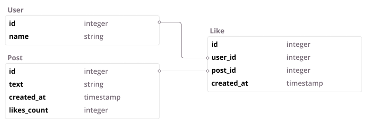

# GraphQL::FancyLoader

FancyLoader (built on top of the [graphql-batch][graphql-batch] gem) efficiently batches queries
using postgres window functions to allow advanced features such as orders, limits, pagination, and
authorization scoping. Built on top of Arel, FancyLoader is highly extensible and capable of
handling complex sorts (including sorting based on a join) with minimal effort and high performance.

We use FancyLoader in production to power large swaths of the Kitsu GraphQL API.

[graphql-batch]: https://github.com/Shopify/graphql-batch

## Installation

Add this line to your application's Gemfile:

```ruby
gem 'graphql-fancy_loader'
```

And then execute:

```
$ bundle install
```

Or install it yourself as:

```
$ gem install graphql-fancy_loader
```

## Basic Usage

### Defining a Loader

FancyLoader isn't meant to be called directly. Instead, you create a subclass which defines how to
load a given model, and what sorts to expose on it.

For example, given the following schema:



You might create a PostsLoader like this:

```ruby
# graphql/loaders/posts_loader
class Loaders::PostsLoader < GraphQL::FancyLoader
  from Post
  sort :created_at
end
```

### Using the Loader

This loader class provides two primary methods: `.sort_argument` and `.connection_for`.
`.sort_argument` gives you a convenient auto-generated sort field which allows for multiple sorts.
`.connection_for` is a wrapper around graphql-batch which returns a connection. Pagination will be
automatically applied to this connection by the graphql gem, so you just need to pass in your other
options:

```ruby
# graphql/types/user.rb
class Types::User < Types::BaseObject
  field :posts, Types::Post.connection_type, null: false do
    argument :sort, Loaders::PostsLoader.sort_argument, required: false
  end

  # Default sorts are just default parameters!
  def posts(sort: [{ on: :created_at, direction: :desc }])
    Loaders::PostsLoader.connection_for({
      find_by: :user_id,
      sort: sort
    }, object.id)
  end
end
```

### Testing the Loader

Testing a FancyLoader is pretty much exactly the same as testing any other graphql-batch Loader
class:

```ruby
RSpec.describe Loaders::PostsLoader do
  let!(:user) { create(:user) }
  let!(:posts) { create_list(:post, 10, user: user) }
  let(:context) do
    GraphQL::Query::Context.new(query: OpenStruct.new(schema: YourSchema), values: nil, object: nil)
  end
  let(:sort) { [{ on: :created_at, direction: :desc }] }

  it 'loads all the posts for a user' do
    posts = GraphQL::Batch.batch do
      described_class.connection_for({
        find_by: :user_id,
        sort: sort,
        context: context
      }, user.id).nodes
    end

    expect(posts.count).to eq(user.posts.count)
  end
end
```

### Applying Authorization to the Loader

To provide authorization, FancyLoader allows for setting middleware that can modify the query before
it's run. These middleware receive an ActiveRecord::Relation and are expected to return an
ActiveRecord::Relation.

FancyLoader currently ships with one middleware, integrating Pundit authorization.

#### Pundit

The Pundit middleware automatically applies Pundit scopes. This _does not_ apply `#show?`, so make
sure your Pundit scope is set up correctly!

To provide the `current_user` to the Pundit middleware, set it on the GraphQL `context` and then
tell the middleware which key it should check:

```ruby
# initializers/graphql_fancy_loader.rb
GraphQL::FancyLoader.configure do |config|
  config.middleware = [GraphQL::FancyLoader::PunditMiddleware.new(key: :token)]
end
```

#### Cancancan (Coming Soon)

## Advanced Usage

### `modify_query`

The `modify_query` declaration is a general-purpose escape-hatch for customizing the query. Similar
to the Middleware system, this allows you to modify the query before it is sent, but unlike the
Middleware, this will give you access to the actual Arel query we've generated. This lambda is run
in the context of the QueryGenerator, which means you can access instance variables such as
`context`.

A common usage for this is to take a sparse-ranked column (such as one managed by [ranked-model])
and create a column with the human-friendly rank value. This is, in fact, so common that we provide
a helper utility, `RankQueryGenerator`! This handy little class generates an Arel column with a
`_rank` suffix (customizable) that makes it look like a normal 1-indexed list!

[ranked-model]: https://github.com/brendon/ranked-model

```ruby
class Loaders::InstallmentsLoader < Loaders::FancyLoader
  from Installment
  modify_query ->(query) {
    release_rank = GraphQL::FancyLoader::RankQueryGenerator.new(
      column: :release_order,
      partition_by: @find_by,
      table: table
    ).arel

    query.project(release_rank)
  }

  sort :release_order
end
```

### `sort transform:` and `sort on:`

You can also modify sorts by supplying procs for the `transform:` and `on:` parameters.

`transform:` is run when the sort is applied, and allows you to modify the generated query (like a
`modify_query` that only runs when the sort is present). This is useful if you need to join another
table for your sort.

`on:` is called to determine which Arel field to sort by. By default, the sort will just use the
same column as its own name. With `on:` you can use fields from a joined table, or even generate a
virtual column for sorting!

```ruby
class Loaders::PostLikesLoader < Loaders::FancyLoader
  from PostLike
  sort :following,
    transform: ->(ast, context) {
      follows = Follow.arel_table
      likes = PostLike.arel_table

      condition = follows[:followed_id].eq(likes[:user_id]).and(
        follows[:follower_id].eq(context[:current_user].id)
      )

      ast.join(follows, Arel::Nodes::OuterJoin).on(condition)
    },
    on: -> { Follow.arel_table[:id] }

  sort :created_at
end
```

## Development

After checking out the repo, run `bin/setup` to install dependencies. Then, run `rake spec` to run
the tests. You can also run `bin/console` for an interactive prompt that will allow you to
experiment.

To install this gem onto your local machine, run `bundle exec rake install`. To release a new
version, update the version number in `version.rb`, and then run `bundle exec rake release`, which
will create a git tag for the version, push git commits and tags, and push the `.gem` file to
[rubygems.org](https://rubygems.org).

## Contributing

Bug reports and pull requests are welcome on GitHub at
https://github.com/hummingbird-me/graphql-fancy-loader.

## License

The gem is available as open source under the terms of the [Apache-2.0 License](https://opensource.org/licenses/Apache-2.0).
